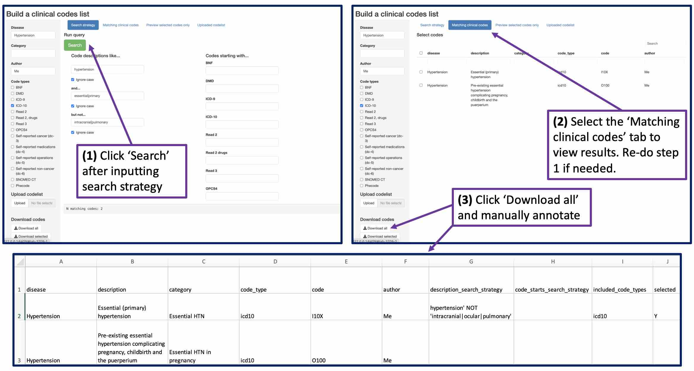

```{r, include = FALSE}
knitr::opts_chunk$set(
  collapse = TRUE,
  comment = "#>"
)
```

```{r setup}
library(codeminer)
```

# Introduction

The goal of codeminer is to simplify working with clinical codes for research using electronic health records. The workflow is as follows:

1.  Create a local resource containing lookup and mapping tables for various clinical codings systems (e.g. ICD10 and Read codes)
2.  Build clinical code lists for conditions of interest by querying this resource

This vignette demonstrates the above using dummy data included with the package. You can try out the steps either locally by installing codeminer on your own machine, or online by clicking on the following link to RStudio Cloud[^1] and navigating to this Rmd file in the 'vignettes' directory: [](https://rstudio.cloud/project/4007004)

[^1]: You will be asked to sign up for a free account if you do not have one already.

Also included are functions for mapping between different clinical coding systems, and using CALIBER code lists[@kuan2019] and Phecodes[@denny2016; @wu2019] with UK Biobank data. See vignettes `vignette('MAP')` `vignette('caliber')` and `vignette('phecodes')` for further information.

# Build a local clinical codes lookup and mappings resource

The first step is to create a local database containing lookup and mapping tables for various clinical coding systems using `build_database()`.

By default this will download the following resources:

-   UK Biobank resource 592 ([Clinical coding classification systems and maps](https://biobank.ndph.ox.ac.uk/ukb/refer.cgi?id=592))

-   UK Biobank [data codings file](https://biobank.ctsu.ox.ac.uk/crystal/exinfo.cgi?src=accessing_data_guide)

-   [Phecode lookup and mapping files](https://phewascatalog.org/) (for ICD9 and ICD10 to phecode)

The tables are imported into R, reformatted, and stored as a named list of data frames:

```{r create_dummy_database}
# Create a temporary database with dummy data
(db_path <- create_dummy_database())
Sys.getenv("CODEMINER_DB_PATH")
```

Setting the `CODEMINER_DB_PATH` environment variable ensures that all subsequent `codeminer` calls will use this database.

To persist the database across sessions, set the `CODEMINER_DB_PATH` environment variable to a path on your system, e.g. using
[`usethis::edit_r_environ(scope = "project")`](https://usethis.r-lib.org/reference/edit.html?q=edit_r_environ#ref-usage):

```
# ./.Renviron
CODEMINER_DB_PATH=/path/to/codeminer-database.duckdb
```

Alternatively, if the environment variable is not set, `codeminer` will store the database in a default location,
determined by
[`rappdirs::user_data_dir()`](https://rappdirs.r-lib.org/reference/user_data_dir.html).

The database is a [duckdb](https://r.duckdb.org/index.html) database and can be inspected using the
[DBI](https://dbi.r-dbi.org/) package.

```{r connect_to_db}
# connect to Duckdb database
con <- DBI::dbConnect(duckdb::duckdb(), db_path, read_only = TRUE)
DBI::dbListTables(con)

# Close the connection when you're done
DBI::dbDisconnect(con)
```

Note that manual interaction with the database should not be necessary, `codeminer` will take care of this for you.


# Build a clinical code list

## Explore codes

Codes may be explored with:

- `CODES()`: look up descriptions for a set of code in the given code system type

```{r CODES}
CODES(
  codes = c("E10", "E11"),
  code_type = "icd10"
)
```

- `DESCRIPTION():` search for codes that match a description

```{r DESCRIPTION}
DESCRIPTION(
  reg_expr = "cyst",
  code_type = "icd10",
)
```

<!-- TODO: add in `CHILDREN()` again, once supported -->

<!-- ```{r CHILDREN} -->
<!-- CHILDREN( -->
<!--   codes = "E10", -->
<!--   code_type = "icd10" -->
<!-- ) -->
<!-- ``` -->


## R Shiny app

<!-- TODO: to be moved to the `codeminer-app` package vignettes -->

Use `RunCodelistBuilder()` to launch a R Shiny app for building a clinical code list.[^3] The aim is to develop a broad search strategy that captures all clinincal codes that might possibly be included, then download the search results and manually select and sub-categorise the final set of codes:

[^3]: This is still quite experimental, but should hopefully work for the basic workflow described here.

{width="100%"}

> Microsoft excel auto-formatting can cause problems with certain codes e.g. Read 3 '.7944' (Creation of permanent gastrostomy) may be reformatted to '7944'. Ideally use a different text editor.
